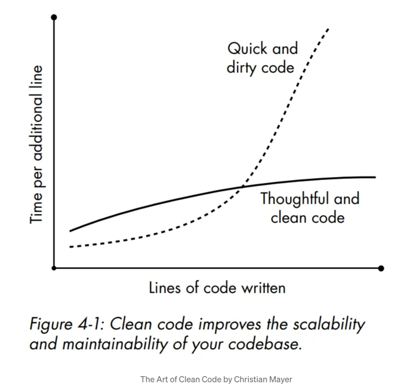

# Chapter 1.Birth
- 객체는 **살아있는 유기체** 이다.
- 객체는 자신의 **가시성 범위** 안에서 살아간다.
- 예제) if 블록 내부가 **extra 객체**의 **가시성 범위**이다.
  - 객체의 가시성 범위가 중요한 이유는 객체는 살아있는 유기체이기 때문이다.  
      ````java
      - 객체 내부에 존재 : 5
      - 객체 외부에 존재 : price
      if(price < 100){
        Cash extra = new Cash(5);
        price.add(extra);
      }
      ```` 
- **책의 목표**는 코드의 **유지보수성(maintainability)을 향상**
  - 다른 사람이 코드를 이해할 수 없다면 **문제의 원인은 여러분**에게 있다.
  - 객체와 객체의 역할을 이해함으로써 코드 유지보수성 향상 시킬 수 있다.
    - `코드는 짧아지고, 모듈성 및 응집도 향상`
  - `코드 품질 향상`은 프로젝트에서 `비용 절감을 의미`한다.
    - 버그 감소
    - 확장성 & 유연성 향상  
      

### 1. -er로 끝나는 이름을 사용하지 마세요.

#### [클래스] 
- **클래스는** 객체의 **팩토리**이다.
- 클래스는 객체를 생성한다.(클래스가 객체를 **인스턴스화한다** 라고 표현)
- **클래스는 객체의 템플릿이 아니다.**
- **클래스를 객체의 능동적인 관리자로 생각**해야 한다.
  - 클래스에서 객체를 꺼내거나 반환할 수 있다.  
    - **클래스를 저장소** 또는 **웨어하우스**라고 불러야 한다.
    - **클래스는 객체의 어머니**라고 할 수 있다. 

#### [클래스 이름을 짓는 적절한 방법]
- **잘못된 방법**은 객체들이 무엇을 하고 있는(doing)지 살편본 후 **기능(functionality)에 기반해서 이름을 짓는것**이다.
  - CashFormatter : 존중할 만한 객체가 아니다! 의인화 불가
    - Cash, USDCash, CashInUSD 같은 이름으로 변경 되어야 한다.
  - **클래스의 이름은 기능에 기반해서는 안된다.**
- 객체는 그의 **역량**(**capability**)으로 특징 지어야 한다. 
  - ex) 내가 어떤 사람인지 키, 몸무게, 피부색과 같은 속성이 아니라, **내가 할수 있는 일**(**What I can do**)로 설명 해야 한다.
- `-er, -or` 로 끝나는 이름을 가진 수많은 잘못 지어진 클래스들이 존재한다.
  - Manager, Controller, Helper, Encoder, Decoder, Dispatcher, Util, Utils, Target, source ...
- **객체는 캡슐화된 데이터의 대표자(representative)이다.**
  - 객체는 객체 외부 세계와 내부 세계를 이어주는 연결장치가 아니다.
  - **대표자는 스스로 결정을 내리고 행동할 수 있는 자립적인 엔티티이다.**
- 클래스의 이름은 **무엇을 하는지**(**what he does**)가 아니라 **무엇인지**(**what he is**)에 기반해야 한다.
- 예시) 오직 소수만으로 구성된 리스트를 얻는 클래스 네이밍
  - Primer, PrimeFinder, PrimeChooser, PrimeHelper 등으로 지으면 안된다.
  ````java
  class PrimeNumbers{
    List<Integer> origin;
    PrimeNumbers(List<Integer> origin){
        this.origin = origin;
    }
    ...
  }
  ````

### 2. 생성자 하나를 주 생성자로 만드세요.
- 생성자(ctor)는 새로운 **객체에 대한 진입점** 이다.
  - 몇 개의 인자들을 전달받아, 어떤 일을 수행한 후, 임무를 수행할 수 있도록 **객체를 준비시킨다**.
  ````java
  //생성자 예시
  class Cash{
    private int dollars;
    Cash(int dlr){
        this.dollars = dlr;
    }
  }
  ````
#### [생성자]
- 보통 생성자(ctor)의 수가 메서드의 수보다 많아진다.
  - 2~3개의 메서드, **5 ~ 10개의 생성자를 포함하는 것이 적당**하다.
- **응집도가 높고 견고한 클래스**에는 적은 수의 메서드와 더 **많은 수의 생성자가 존재**한다.
- 생성자가 많을수록, 클라이언트가 **클래스를 유연하게 사용**할 수 있다.
  ````java
  new Cash(30);
  new Cash("$29.95");
  new Cash(29.95d);
  new Cash(29.95, "USD");
  ````
- **퍼블릭 메서드를 많이 제공하면 유연성이 저하**된다.
- 메서드가 많아지면 클래스의 초점이 흐려지고, **단일 책임 원칙(SRP)를 위반**한다.
- 생성자의 주된 작업은 **제공된 인자를 사용해서 캡슐화하고 있는 프로퍼티를 초기화**하는 일이다.
- **초기화 로직을 단 하나의 생성자에만 위치**시키고, **부 생성자들이 주 생성자를 호출하도록 만드는것을 권장**한다.
- 하나의 주 생성자 다수의 부 생성자 원칙 (one primary, many secondary)의 핵심
  - **중복코드 방지, 설계 간결, 유지보수성 향상** 
    ````java
    # GOOD : 유연함, 생성자에 사용되는 dlr이 음수불가 조건이 추가될때
             주 생성자만 수정하면 된다.
    class Cash{
      private int dollars;
      Cash(float dlr){
          //부 생성자
          this((int) dlr);
      }
      Cash(String dlr){
          //부 생성자
          this(Cash.parse(dlr));
      }
      Cash(int dlr){
          //주 생성자 - 최 하단에 위치시키는것이 추후 찾기에 편하다.
          this.dollars = dlr;
      }
      private static int parse(String str){
          return Integer.valueOf(str);
      } 
    }
    ````
    ````java
    # BAD : 만약 클래스에 들어오는 dlr이 음수가 될 수 없으면 각 생성자마다 로직을 추가해야 한다.
    class Cash{
      private int dollars;
      Cash(float dlr){
          this.dollars = (int)dlr;
      }
      Cash(String dlr){
          this.dollars = Cash.parse(dlr);
      }
      Cash(int dlr){
          this.dollars = dlr;
      }
      private static int parse(String str){
          return Integer.valueOf(str);
      } 
    }
    ````  
#### [메서드 오버로딩]
- **이름은 동일**하지만 **서로 다른 인자를 가지는 메서드 또는 생성자를 정의**할 수 있는 기법
- 객체지향 프로그래밍에서 반드시 제공되어야 하는 중요한 기능이다.
  - **가독성을 극적으로 향상**시킬 수 있다.
  ````java
  content(File), contentInCharset(File, Charset)
  
  //메서드 오버로딩을 통해 코드가 간결해진다.
  content(File), content(File, Charset)
  ````

### 3. 생성자에 코드를 넣지 마세요

- **생성자는 객체 초기화 프로세스를 시작하는 유일한 장소**이기 때문에 **제공되는 인자들은 완전**해야 한다.
  - 완전하다는 의미?
    - 누락된 정보가 없어야 한다.(객체를 올바르게 초기화하기 위해 필요한 **모든 매개변수가 전달**)
    - 중복되는 정보가 없어야 한다.
- **'인자에 손대지 말라'**, **객체 초기화에는 코드가 없어야 하고 인자를 건드려서는 안된다.**
  - 필요하다면, 인자들을 **다른 타입의 객체로 감싸거나**, **가공하지 않은 형식으로 캡슐화** 해야 한다.
  ````java
  # BAD : 객체를 초기화하는데, 인자를 건드림.
  class Cash{
    private int dollars;
    Cash(String dlr){
        this.dollars = Integer.parseInt(dlr); //객체 초기화시 형변환을 함.
    }
  }
  ````
  ````java
  
  # GOOD : 인자를 건드리지 않으며, 객체를 사용하는 시점까지 객체의 변환 작업을 연기한다.
  1. 진정한 객체지향에서 인스턴스화란 더 작은 객체들을 조합해서 더 큰 객체를 만드는 것을 의미한다.
  2. 생성자 안에서 인자에게 어떠한 작업을 하도록 요청해서는 안된다.
  3. 요청이 있을 때 파싱하도록 하면, 클래스의 사용자들이 파싱 시점을 자유롭게 결정할 수 있게 된다.
  4. 객체를 인스턴스화하는 동안에는 객체를 '만드는(build)'일 외에는 어떠한 일도 수행하지 않는다.
     실제 작업은 객체의 메서드가 수행하도록 한다.
  5. 클래스가 하는 역할이 언제 어떻게 변경될지 모르므로, 생성자에서 어떤일을 처리하는것은 추후 유지보수에도 좋다.
  
  class Cash{
    private Number dollars;
    
    Cash(String dlr){
        this(new StringAsInteger(dlr));
    }
    Cash(Number dlr){
        this.dollars = dlr; //주 생성자
    }
  }
  
  class StringAsInteger implements Number {
    private String source;
    StringAsInteger(String src){
        this.source = src;
    }
    int intValue(){
      return Integer.parseInt(this.source);
    }
  }
  
  Number num = new StringAsInteger("123");
  num.intValue(); //실제작업은 객체의 메서드가 실행
  ````

  - 표면적으로 두 Cash 클래스로부터 인스턴스 생성 과정은 동일해 보인다.
    ````java
    Cash five = new Cash("5");
    ````
  - 첫 번째 예시는 숫자 5를 캡슐화, 두 번째는 인스턴스(StringAsInteger) 를 캡슐화한다.
  - 진정한 객체지향에서 **인스턴스화**란 **더 작은 객체들을 조합해서 더 큰 객체를 만드는 것을 의미**한다.
    - 객체들을 조합해야하는 이유는 **새로운 계약을 준수하는 새로운 엔티티**가 필요하기 때문이다.
      - 기존의 계약은 Number만 허용하였으나, 새로운 계약을 준수하는 새로운 엔티티(StringAsInteger)가 추가 되었다.
- 생성자에 코드를 넣으면 안되는 이유
  - 성능 최적화가 더 쉽다.
  - 인자를 전달된 상태 그대로 캡슐화하고 나중에 요청이 있을때 파싱하도록 하면, **클래스의 사용자들이 파싱 시점을 자유롭게 결정**할 수 있다.
  ````java
  class StringAsInteger implements Number{
    private String text;
    public StringAsInteger(String txt){
        this.text = txt;
    }
    public int intValue(){
        return Integer.parseInt(this.text);
    }
  }
  
  //코드 사용
  Number five = new StringAsInteger("5");
  ...
  if(/* 오류 */){
    throw new Exception("오류 발생");
  }
  five.intValue();
  ````
- 파싱이 여러번 수행되지 않도록 하고 싶다면 **데코레이터를 추가하여, 최초 파싱결과를 캐싱**
  ````java
  class CachedNumber implements Number{
    private Number origin;
    private Collection<Integer> cached = new ArrayList<>(1);
    public CachedNumber(Number num){
        this.origin = num;
    }
    public int intValue(){
        if(this.cached.isEmpty()){
            this.cached.add(this.origin.intValue());
        }
        return this.cached.get(0);
    }
  }
  
  //코드 사용
  Number num = new CachedNumber(
    new StringAsInteger("123")
  );
  num.intValue();//처음에는 파싱처리
  num.intValue();//캐싱된 결과 전달
  ````
- **객체를 인스턴스화하는 동안에는 객체를 만드는(build) 일 이외에는 어떤 일도 수행하지 않는 것이 좋다.**


#### Q&A
- 중복되는 정보가 없어야 한다.
