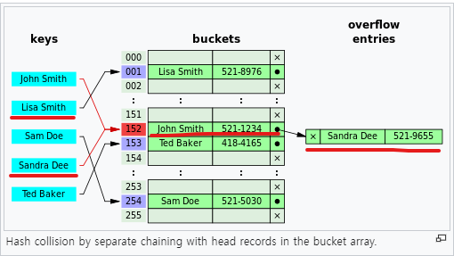
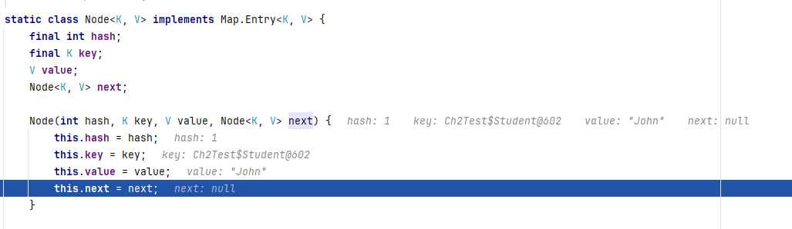
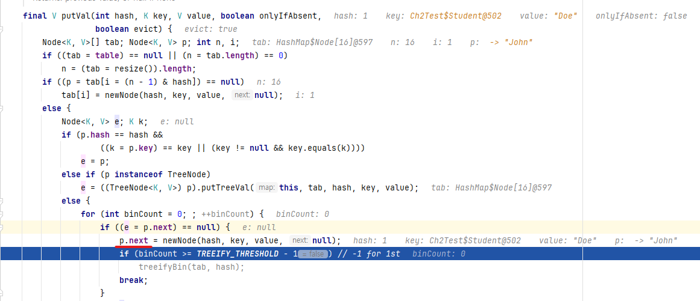
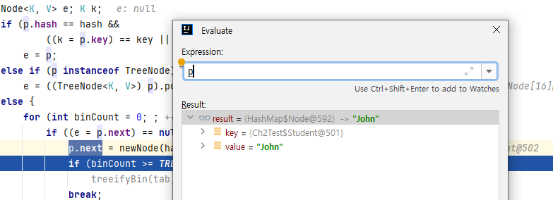
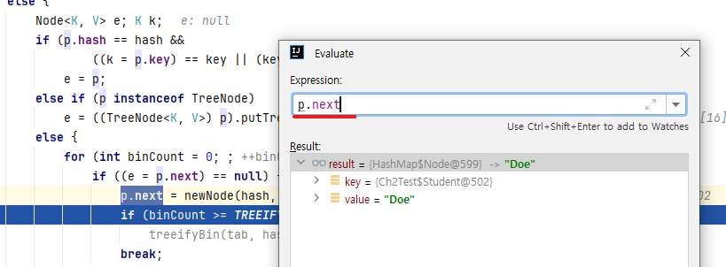
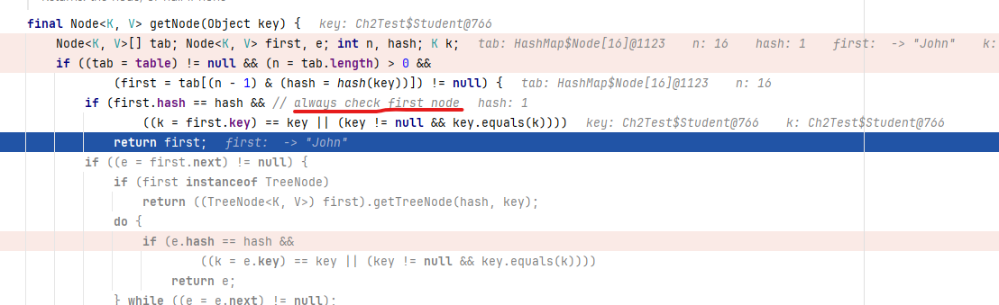
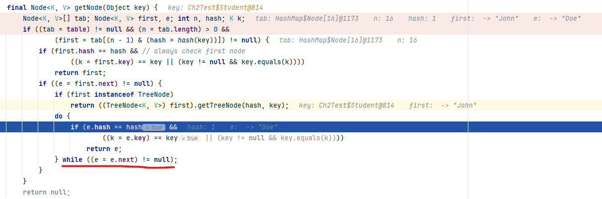

# Chapter 2.Education
- `객체를 다른 객체와 상호작용`할 수 있도록 준비시키기 위해 필요한 몇 가지 원칙을 설명
- 이번 챕터에서 배우게 될 교훈은 **객체는 작아야 한다** 이다.
  - **작은 객체**란 `우아한 동시에 유지보수 가능한 객체`이다.

### 1. 가능하면 적게 캡슐화 하세요.
- `복잡성`은 직접적으로 `유지보수성`에 영향을 미친다.
  - 복잡성이 높을수록 유지보수성 저하, 시간&돈 낭비, 고객 만족도 감소
- `클래스내 객체수`를 **4개** 또는 그 이하의 객체를 `캡슐화`할 것을 권장한다.
  - 4개이상의 객체수가 캡슐화되어 있을때는, `리팩터링이 필요한 시점`이다. 
  - 예외는 없다. **항상 4개 이하로 유지**하도록 노력해야 한다.
- 캡슐화된 객체 전체를 가리켜 `객체의 상태` 또는 `식별자`라고 부른다.
- Java 언어의 설계적 결함으로, **객체의 식별자와 상태는 서로 분리**되어 있다. 
  - 객체 지향 프로그래밍에서 **객체의 동일성은 객체를 식별하는 고유한 식별자(identifier)에 의해 결정**되고, **상태는 객체가 가지는 데이터의 값으로 결정**
  - equals를 별도로 구현해야 한다.
  - 끔찍하게 잘못된 방식이다.
  ````java
  Cash x = new Cash(29,95, "USD");
  Cash y = new Cash(29,95, "USD");
  x == y //동일한 식별자(오류)
  x.equals(y) //객체의 상태 비교(오류)
  ````
- OOP의 `객체`는 고수준의 행동을 낳기 위해 `함께 동작하는 객체들의 집합체`(**aggregation**) 이다.
  - 자동차는 바퀴, 엔진, 유리 의 집합체... 
- **상태 없는 객체는 존재해서는 안되고, 상태는 객체의 식별자여야 한다**
  - 4개 이상의 좌표는 직관에 위배된다. 
  - **최댓값은 4**이므로, 더 많은 객체가 필요하다면 **더 작은 클래스로 분해**해야 한다.
- Java의 결함을 해결하기 위해 == 연산자가 아니라 항상 **equlas() 메서드를 오버라이드** 해야 한다!

  ````java
  //필자는 다음과 같은 방식으로 자바가 구현돼야 한다고 생각
  Cash x = new Cash(29,95, "USD");
  Cash y = new Cash(29,95, "USD");
  assert x.equals(y);
  assert x==y;
  ````
  ````java

  1. 4개 이하로 충분히 Cash 클래스의 객체를 식별할 수 있다.
  2. == 대신, equals() 메서드를 오버라이드해서 객체의 동일성을 체크하자.
  class Cash{
     private Integer digits;
     private Integer cents;
     private String currency;
  }
  
  class CashTest{
  
    @Test
    @DisplayName("Cash constructor without Equals and Hashcode")
    public void cashConstructorWithout(){
      CashWithoutEqualsAndHashCode x = new CashWithoutEqualsAndHashCode(29,95,"USD");
      CashWithoutEqualsAndHashCode y = new CashWithoutEqualsAndHashCode(29,95,"USD");
      Assertions.assertNotEquals(x,y);
    }

    @Test
    @DisplayName("Cash constructor")
    public void cashConstructor(){
       Cash x = new Cash(29,95,"USD");
       Cash y = new Cash(29,95,"USD");
       Assertions.assertEquals(x,y);
    }

    @Test
    @DisplayName("withoutHashCode")
    public void withoutHashCode(){
        HashSet<Cash> set = new HashSet<>();

        Cash x = new Cash(29,95,"USD");
        Cash y = new Cash(29,95,"USD");

        set.add(x);
        set.add(y);

        Assertions.assertEquals(1,set.size());
        Assertions.assertNotEquals(2,set.size());
    }
  }
  ```` 

### 2. 최소한 뭔가는 캡슐화하세요.
- 너무 많이 캡슐화하는 방식도 좋지 않지만, **아무것도 캡슐화하지 않는 방식 또한 바람직하지 않다**.
  - 프로퍼티가 없는 클래스는 객체지향 프로그래밍에서 **악명이 높은 정적 메서드(static method) 와 유사**하다.
    - 객체 지향 원칙 위배(캡슐화), 유지보수의 어려움(의존성 증가)
- 아래 예제는 **아무런 상태와 식별자도 가지지 않고 오직 행동만을 포함**한다.
  - 정적 메서드가 존재하지 않고, **객체의 생성과 실행을 엄격하게 분리하는 순수한 OOP** 에서는 프로퍼티가 없는 클래스를 만들 수 없다.
````java
//프로퍼티가 없고, 객체를 생성하지 않으면서 기능을 제공한다.
class Year{
    int read(){
        return System.currentTimeMillis()/ (1000*60*60*24*30*12) - 1970;
    }     
 }
````
- **실행으로부터 인스턴스 생성을 고립시켜야 한다**.
  - **오직 생성자에서만 new 연산자를 허용**해야 한다는 의미이다.
````java
//프로퍼티를 제공하며, 객체를 생성된 이후에 기능을 제공한다.
class Year{
    private Number num;
    Year(final Millis mesc){
        this.num = msec.div(
            1000.mul(60).mul(60).mul(24).mul(30).mul(12)
        ).min(1970);
    } 
    int read(){
        return this.num.intValue();
    }     
}
````
- 객체가 ‘무(nothing)’와 아주 비슷한 어떤 것이 아니라면 **무언가를 캡슐화**해야 한다.
  - 자신의 좌표를 표현하기 위해 다른 엔티티를 필요로 하지 않은것
    - ex) String, ArrayList
- 객체가 어떤 것도 캡슐화하지 않는다면 객체의 좌표는 무엇일까?
  - 객체 자신이 세계 전체가 되어야 한다.
  - ````java
    class Universe{
    }
    ````


### 3. 항상 인터페이스를 사용하세요.

- `객체`는 `살아있는 유기체`이다.
- `객체`는 `다른 객체와 유기적으로 협동`한다.
  - 객체는 다른 객체들과 의사소통하면서 그들의 작업을 지원, 다른 객체들 역시 이 객체에 도움을 제공한다.
- 따라서, **객체들은 서로를 필요로 하기 때문에 결합**된다.(coupled)
- 애플리케이션이 성장하면 **객체 사이의 강한 결합도(tight coupling)이 문제로 떠오른다**.
  - 강한 결합도는 **유지보수에 영향**을 미친다.
- **이 책의 목표는 유지보수성에 초점**을 맞춘다. 
- 애플리케이션 전체를 유지보수 가능하도록 만들기 위해서는 최선을 다해서 객체를 분리해야(decouple) 한다.
  - **응집도를 높이고, 결합도를 낮춘다.**
- 이를 가능하게 하는것이 바로 **인터페이스**(interface)이다.
---
- 인터페이스에는 다른 객체와 의사소통하기 위해 따라야 하는 **계약(contract)이 명시**되어 있다.
````java
interface Cash{
    Cash multiply(float factor);
}

class DefaultCash implements Cash{
    private int dollars;
    DefaultCash(int dlr){
        this.dollars = dlr;
    }
    @Override
    Cash multiply(float factor){
        return new DefaultCash(this.dollars * factor);
    }
}
````
- **Cash 인터페이스를 이용**하면 Employee 클래스와 DefaultCash 클래스의 **결합도를 낮출 수 있다**.
- Employee 클래스는 Cash 인터페이스의 구현 방법에 아무런 관심이 없다.
````java
class Employee{
    private Cash salary;
}
````
- 클래스 안의 **모든 퍼블릭 메서드가 인터페이스를 구현하도록 만들어야 한다**.
- 올바르게 설계된 클래스는 **최소한 하나의 인터페이스를 구현**하고, 해당 **인터페이스에 정의된 메서드를 퍼블릭으로 노출**시켜야 한다.
````java
# 잘못 설계된 케이스
1. cents() 는 어떤 것도 오버라이드하지 않는다.
2. Cash 클래스 사용자에게 강하게 결합되도록 조장한다.
3. 다른 클래스가 Cash.cents()를 강제로 사용하게 하므로, 새로운 메서드를 이용해서 구현 을 대체할 수 없다.
class Cash {
    public int cents() {
    // 어떤 작업을 수행한다
    }
}
````
- **클래스의 존재이유**는 다른 객체가 해당 클래스의 서비스를 필요로 하기 때문이다.
- 동일한 인터페이스를 구현하는 여러 클래스들이 존재한다
  - **각각의 클래스는 서로 다른 클래스를 쉽게 대체할 수 있어야 한다**. -> **느슨한 결합도(loose coupling)**
- 여전히 인터페이스를 통해 결합되는것은 마찬가지이다.
  - 부정할 수 없는 사실이다.
  - 하지만, 요소들 사이의 계약으로서 **인터페이스는 우리가 전체적인 환경을 구조화된 상태로 유지할 수 있도록 도와**준다.
````java
interface Cash{
    int cents();
}

class DefaultCash implements Cash{

    @Override
    public int cents() {
        return Integer.MAX_VALUE;
    }
}

class UsdCash implements Cash{

    @Override
    public int cents() {
        return Integer.MIN_VALUE;
    }
}

public class Employee {
  private Cash cash;

  public Employee(Cash cash) {
    this.cash = cash;
  }

  public int toCents() {
    return cash.cents();
  }
}
````
> **각각의 클래스는 서로 다른 클래스를 쉽게 대체할 수 있어야 한다**   
> **Employee 객체는, Cash 객체가 변경되거나 또는 구현체가 변경이 되어도 문제가 생기지 않는다.**
````java
class CashInterfaceTest{
    @Test
    @DisplayName("Cash Interface")
    public void cashInterface(){
        Employee employee = new Employee(new DefaultCash());
        Assertions.assertEquals(Integer.MAX_VALUE,employee.toCents());

        Employee employeeUsd = new Employee(new UsdCash());
        Assertions.assertEquals(Integer.MIN_VALUE,employeeUsd.toCents());
    }
}
````
````java
  interface Cash{
      Cash multiply(float factor);
  }

  class DefaultCash implements Cash{
      private int dollars;      
      DefaultCash(int dlr){
          this.dollars = dlr;
      }
      @Override
      Cash multiply(float factor){
          return new DefaultCash(this.dollars * factor); //TODO 객체요소 변경시, 새로운 객체로
      }
  } 

  class Employee{
      private Cash salary;
  }
````

### 4. 메서드 이름을 신중하게 선택하세요
- `메서드 이름`을 `올바르게 짓는 방법`
  - 빌더(builder)의 이름은 **명사**, 조정자(manipulator)의 이름은 **동사**로 짓는다.
    - 빌더 : **새로 만들고 새로운 객체를 반환하는 메서드 이며**, **반환타입은 절대 void 가 되지 않도록** 하며, 이름은 **명사**로 작성해야 한다.
    ````java
    int pow(int base, int power);
    float speed();
    Employee employee(int id);
    String parsedCell(int x, int y);
    ````
    - 조정자 : **객체로 추상화한 실세계 엔티티를 수정하는 메서드 이며**, **반환 타입은 void가 되도록** 하며, 이름은 **동사**로 작성해야 한다.
    ````java
    void save(String content);
    void put(String key. Float value);
    void remove(Employee emp);
    void quicklyPrint(int id);
    ````
- `빌더`는 어떤 것을 만들고, `조정자`는 뭔가를 조작한다.
- 빌더와 조정자 사이에는 **어떤 메서드도 존재해서는 안된다**.
  - 뭔가를 조작한 후 반환하거나, 뭔가를 만드는 동시에 조작하는 메서드가 있어서는 안된다
  ````java
  //잘못된 예시
  // 저장된 전체 바이트를 반환
  int save(String content);
  // map이 변경된 경우 TRUE를 반환
  boolean put(String key. Float value);
  // speed를 저장한 후 이전 값을 반환
  float speed(float val);
  ````
  - save() 메서드는 조정자지만 빌더처럼 int 값을 반환한다. 
    - void로 변경하거나 bytesSaved() 이름으로 바꿔야 한다.
  - put() 메서드는 조정자지만 빌더처럼 boolean을 반환한다.
    - 성공/실패 여부를 반환하는 빌더인 success() 메서드를 생성해야한다.
  - speed() 메서드는 빌더인 동시에 조정자이다.
    - 스피드를 저장 메서드, 스피드를 구하는 메서드를 나눠야 한다. 
- **getter**는 근본적으로 **어떤 값을 반환하는 빌더**이다. -> get은 동사이기 때문에, 잘못된 네이밍이다.


#### 4.1 빌더는 명사다 
- 어떤 것을 반환하는 메서드의 이름을 **동사로 짓는 것은 잘못된 것**이다.
  - `커피 한 잔 끓여 주세요` 라고 말하지 않고, `커피 한 잔 주세요` 라고 말한다.
  - 커피를 끓이는 정확한 방법은 관심사가 아니다
  - 단지 **객체에게 커피를 요구**할 뿐이다.
  ````java
  class Bakery{
    Food cookBriwnie();
    Drink brewCupOfCoffee(String flavor);
  }

  class Bakery{
    Food food;
    Drink drink(String flavor);
    
  }
  class Food{
  }
  class Drink{
  }
  
  Bakery bakery = new Bakery(new Brownie(), new LatteeCoffe("헤이즐넛"));
  ````
- 객체는 자신의 의무를 수행하는 방법을 알고 있고 존중 받기를 원하는 **살아있는 유기체**이다.
  - 단순히 지시에 따르는 것이 아니라 계약에 기반해 일하고 싶어한다.
  - 메서드의 이름을 동사로 지을 때에는 객체에게 무엇을 할 지(what to do) 알려 주어야 한다.
  - **객채에게 무엇을 만들라고(build) 요청**하는 것은 **협력자에 대한 존중이 결여되어 있고 예의에도 어긋나는 행동**이다.
- 객체에게 **무엇을 만들라고 요청하는 것이 아니라**, **무엇을 할지** 알려준다.
````java
Inputstream load(URL uri); -> InputStream stream(URL uri); 
String read(File file); -> String content(File file);
int add(int x, int y); -> int sum(int x, int y);
````
````java
int add(int x, int y) // bad : 객체에게 더하라고 요청하지 않는다. 
int sum(int x, int y) // good : 합을 계산하고, 객체를 반환해 달라고 요청한다.
````

#### 4.2 조정자는 동사다
- 객체가 무언가를 조정해야 한다면 **이름은 동사**이고 **반환값은 없다**.
- 객체는 **실세계의 엔티티(entity)를 대표** 한다.
- 무언가가 만들어질(build) 것이라고 기대하지 않는다.
  - paint 라는 이름은 동사이고, 기본적으로 **객체에게 어떤 일을 하도록 지시**한다.
    - **paint() 메서드는 값을 반환하지 않는다.**
````java
class Pixel {
    private int x;
    private int y;
    Pixel(int x, int y){
        this.x = x;
        this.y = y;
    }
    void paint(Color color);
}    
Pixel center = new Pixel(50,50);
center.paint(new Color("red")); //'동사'형태로, 그려라 라고 지시를 하며, 반환값은 void 이다.
````
- 빌더들은 이름은 명사이고 이름은 명사이다.
  - 빌더 패턴은 유지보수성이 낮고 응집도가 떨어진다. -> 더 커다란 객체를 만들도록 조장한다.
  - 빌더 패턴은 생성자에 많은 이자를 전달하고 싶지 않을 때 유용하게 사용할 수 있다.
  - 애초에 인자의 수가 많다는 것 자체가 문제이다.
  - **빌더 패턴 대신 복잡한 객체를 더 작은 객체들로 나눠야 한다.**
````java
class Book {
    Book withAuthor(String author); 
    Book withTitle(String title); 
    Book withPage(Page page);
}
````

#### 4.3 빌더와 조정자 혼합하기
- write 메서드는 원칙상 return 타입이 void로 바꿔야 한다.
  - 하지만 우리는 실제로 저장된 바이트 수를 알 필요가 있다.
- write 메서드는 2가지 역할을 하고 있다.
  - **데이터를 쓰고**, **바이트 수를 카운트**
````java
//메서드는 데이터를 쓰는 동시에, 쓰여진 바이트 수를 카운트 한다. (2개 이상의 역할을 한다)
class Document{
    int write(InputStream contents);
}
````
- output() 은 빌더이다.
- 데이터를 쓸 준비를 하는 OutputPipe 객체를 통해 write() 를 쓰고, bytes()를 통해 바이트 수를 카운트 할 수 있다.
````java
//빌더와 조정자를 함께쓴다.OutputPipe 에서 역할이 완벽하게 분리되었다.(write : 쓰기, bytes : 쓰여진 바이트 수)
class Document{
    OutputPipe output(); //빌더
}
class OutputPipe{
    void write(InputStream contents); //조정자
    int bytes(); //빌더
}
````
- **OOP의 전체 목적은 개념을 고립시켜 복잡성을 낮추는 것**이다.
- 하나 이상의 값을 반환하는 메서드는 코드를 지저분하게 하고, 유지보수성을 저하 시킨다.(Go 언어는 2개 이상의 데이터를 리턴할 수 있다.)

#### 4.4 Bollean 값을 결과로 반환하는 경우
- **Boolean 값을 반환하는 메서드**는 규칙에 있어 **예외적인 경우**이다.
- 이 **메서드들은 빌더에 속하지만**, 가독성 측면에서 이름은 명사가 아닌 **형용사**로 짓는다.
  ````java
  boolean empty();
  boolean readable();
  boolean negative();
  ````
- is는 중복이기 때문에, 메서드 이름에는 포함시키지 않는다.
- 그렇다면 Boolean을 반환하는 메서드를 특별하게 취급해야 하는 이유는 무엇일까?
  -  메서드의 이름 을 형용사로 지어야 더 자연스럽게 읽히는 문장이 되기 떄문이다.
  ````java
  if (name.empty) { // 만약 이름이 공백이라면
  }
  ````

> **요약**  
> 1. 메서드는 빌더나 조정자, 둘 중 하나여야 한다.
> 2. 결코 빌더인 동시에 조정자여서는 안된다. 
> 3. 빌더라면 이름을 명사로, 조정자 라면 이름을 동사로 지어야 한다.
> 4. Boolean 값을 반환하는 빌더는 예외에 속한다. 이름을 형용사로 한다.

### 5. 퍼블릭 상수(Public Constant)를 사용하지 마세요

- 상수라고 불리는 public static final 프로퍼티는 **객체 사이에 데이터를 공유하기 위해 사용하는 매커니즘**
- **객체들은 어떤 것도 공유해서는 안된다**. **독립적**이여야 하고 **닫혀** 있어야 한다..
- 즉, 상수를 이용한 공유 메커니즘은 **캡슐화와 객체지향적인 사고 전체를 부정하는 일**이다.
---
- Writer 객체에 기록, 각 줄을 개행(new line) 문자로 종료하는 메서드
- EOL 벨류 중복 발생, Constatns 로 중복 문제를 해결
  - OOP에는 객체가 존재하기 때문에 **퍼블릭 상수를 이용해서 중복 문제를 해결하는 것은 매우 잘못된 접근방법**이다.
  ````java
  class Records {
    private static final String EOL = "\r\n";
  
    void write(Writer out) {
      for (Record rec : this.all) {
        out.write(rec.toString());
        out.write(Records.EOL);
      }
    }
  }
  
  class Rows{
      private static final String EOL = "\r\n";
  
      void print(PrintStream pnt) {
        for (Row row : this.fetch()) {
          pnt.printf("{ %s }%s’\ row. Rows.EOL)；
        }
      }
  }
  ````
- 코드 중복을 해결하기 위해 두 개의 더 큰 문제가 추가 되었다.
1) 결합도 증가
   - 두 클래스는 모두 같은 객체에 의존, 이 **의존성은 하드 코딩**되어 있다.
     - Records.write(), Rows.print(), Constants.EOL
   - Constants.EOL 내용을 수정하면 참조하는 나머지 클래스의 일이 달라진다.
   - 사용자들이 Constants.EOL에 결합될 수 밖에 없도록 만들었고, 유지보수성은 크게 저하되었다.
   - 많은 객체들이 다른 객체를 사용하는 상황에서 **서로를 어떻게 사용하는지 알 수 없다면**, **이 객체들은 매우 강하게 결합되어 있는 것**이다.
2) 응집도 저하
  - 퍼블릭 상수를 사용하면 객체의 **응집도는 낮아진다**.
    - 낮은 응집도는 **객체가 자신의 문제를 해결하는데 덜 집중**한다는 것을 의미한다.
  - Constants.EOL은 **자신에 관해 아무 것도 알 지 못하며, 자신의 존재 이유를 이해하지 못하는 하나의 텍스트 덩어리**에 불과하다.
    - **상수는 삶의 의미가 명확하지 않다.**
  - Records와 Rows의 목적은 한 줄의 마지막을 처리하는 것이 아니라 레코드나 로우 자체를 처리 하는 것이다.
    - 한 줄을 **종료하는 작업을 다른 객체에게 위임**한다면 각 객체의 응집도 를 향상할 수 있다.

#### [결합도 증가, 응집도 저하]
````java
 Constants, Records, Rows 가 강하게 결합되어 있다.
 Constants.EOL이 변경되면 참조하는 나머지 클래스의 일이 달라진다.
 
  public class Constants{
      public static final String EOL = "\r\n";
  }
  
  class Records {
      void write(Writer out){
          for(Records rec : this.all){
              out.write(rec.toString());
              out.write(Constants.EOL);
          }
      }    
  }
 
  class Rows{
      void print(PrintStream pnt){
          for(Row row : this.fecch()){
              pnt.printf("{%s}",row, Constants.EOL);
          }
      }
  }
````
#### [refactor]
- 객체 사이에 데이터를 중복해서는 안된다.
  - 기능을 공유할 수 있도록 EOLString **새로운 클래스 생성**한다.
- **데이터가 아니라 기능을 공유**해야 한다.
- EOLString과의 결합은 **계약(contract)을 통해 추가된 것**이다.
  - **계약에 의한 결합은 언제라도 분리가 가능하기 때문에 유지보수성 향상**된다.
  - EOLString은 계약에 따라 행동하며 내부에 **계약의 의미를 캡슐화**합니다
- 예를들어, 윈도우일경우 예외를 던지도록 코드를 수정하는 요청이 들어올때도 **다른 객체와의 계약은 동일하게 유지**하면서 동작은 변경할 수 있다.
  - public static 의 경우 이러한 변경이 불가능하다.
- 퍼블릭 상수마다 계약의 의미를 캡슐화하는 새로운 클래스를 만들어야 한다는 것을 의미하는 것일까? -> 맞다
- 수백 개의 단순한 상수 문자열 리터럴 대신 수백 개의 마이크로 클래스를 만들어야 한다는 것을 의미하는 것일까? -> 맞다
- **애플리케이션을 구성하는 클래스의 수가 많을수록 설계가 더 좋아지고 유지보수하기도 쉬워진다**.
````java
class EOLString{
    private final String origin;
    EOLString(String src){
        this.origin = src;
    }
    @Override
    String toString(){
        if (/* Windows의 경우 */) {
          throw new IllegalStateException(”현재 Windows에서 실행 중이기 때문에 EOL을 사용할 수 없습니다. 죄송합니다." )；
        }
        return String.format("%s\r\n", origin);
    }
}

class Records {
    void write(Writer out){
        for(Records rec : this.all){
            out.write(new EOLString(rec.toString()));
        }
    }    
}

class Rows{
    void print(PrintStream pnt){
        for(Row row : this.fecch()){
            pnt.printf(
                new EOLString(String.format("{%s}"),row)
            );
        }
    }
}
````

#### [Http 요청 메서드 예제]
- `POST` 리터럴의 의미를 기억할 필요가 없다.
- PostRequest는 **POST 리터럴의 의미론(semantic)인 설정 로직을 내부에 캡슐화**한다.
````java
    //BAD : 하드코딩
    String body = new HttpRequest().method("POST").fetch();

    //BAD : 퍼블릭 상수를 사용하는 예제
    String body = new HttpRequest()
        .method(HttpMethods.POST) //퍼블릭 상수
        .fetch();
  
    //GOOD : post 리터럴의 의미를 기억할 필요 없이, Post 방식으로 요청을 전송하기만 하면 된다.
    String body = new PostRequest(new HttpRequest()).fetch();
````

#### [요약]
- OOP에서 **퍼블릭 상수를 절대로 사용해서는 안된다.**
- 아무리 사소해 보이는 상수라도 **항상 작은 클래스를 이용해서 대체**해야 한다.
- 퍼블릭 상수를 이용해서 코드 중복 문제를 해결하지 말고 대신 **클래스를 사용**해야 한다.
- 열거형(enum)과 퍼블릭 상수 사이에 는 아무런 차이도 없기 때문에 **열거형 역시 사용해서는 안된다.**

### 6. 불변 객체로 만드세요.
- **모든 클래스를 상태변경이 불가능한 불변 클래스(immutable class)로 구현**하면 **유지보수성을 크게 향상**시킬 수 있다.
  - **불변성** 역시 크기가 작고, 응집력이 높으며, 느슨하게 결합되고, 유지보수하기 쉬운 클래스를 만들 수 있도록 한다.
- **불변 객체를 기반으로 사고**하면 **더 깔끔하고, 더 작고, 더 쉽게 이해할 수 있는 코드**를 만들 수 있다.
- **인스턴스 생성한 후**, **상태를 변경할 수 없는 객체**를 **불변 객체**라고 부른다.
---
- to-be 에 private dollars 프로퍼티에 **final** 이 추가 되었다.
  ````java
  //as-is
  class Cash{
      private int dollars;
      
      public void setDollars(int val){
          this.dollars = val;
      }
  }
  //to-be
  class Cash{
      private final int dollars;
      Cash(int val){
          this.dollars = val;
      }
  }
  ````
- final 키워드는 생성자 외부에서 값 수정시 **컴파일 에러가 발생**한다.
  - **불변 객체**는 **필요한 모든 것을 내부에 캡슐화** 하고 **변경 할 수 없도록 통제**한다.
  - **불변 객체를 수정해야 한다면 새로운 객체를 생성해야 한다**.
````java
//bad 프로퍼티가 변경 가능한 코드 (가변객체)
class Cash {
    private int dollars;
    public void mul(int factor) {
        this.dollars *= factor; 
    }
}

//가변객체의 예제 - 사용
Cash five = new Cash(5);
five.mul(10);
System.out.println(five); // "$50"이 출력

//good 프로퍼티가 변경 불가능한 코드 (불변객체)
class Cash {
  private final int dollars; public Cash mul(int factor) {
    return new Cash(this.dollars * factor); 
  }
}

//불변객체의 예제 - 사용
Cash five = new Cash(5);
Cash fifty = five.mul(10);
System.out.println(fifty); // "$50"이 출력
````
- **가변 객체**는 **전반적인 객체 패러다임의 오용**이다.
  - **가변 객체의 사용을 엄격하게 금지**해야 한다.
  - **모든 클래스**는 상태를 절대로 변경하지 않는 **불변 객체를 인스턴스화 해야 한다**.
- 가변객체의 예제는 five 객체가 **'5'달러가 아닌 '50'달러 처럼 행동**하고 있다.
---
- 기술적으로 불변 객체를 사용해서 지연 로딩을 구현하는 것은 불가능 하다.(java, ruby, c++)
- 자바에서는 유사한 기능을 현재 제공하고 있진 않다.
- 필자는 **언어 차원에서 지연 로딩을 제공해야 한다고 생각**한다. 
````java
class Page {
  private final String uri; 
  private String html; Page(String address) {
    this.uri = address; 
    this.html = null;
  }
  @OnlyOnce //필자가 생성하는 필요로 하는 지연로딩 어노테이션
  public String content() {
    if (this.html == null) {
        this.html = /* 네트워크로부터 로드한다 */
    }
    return this.html;
  } 
}
````

#### 1) 식별자 가변성(Identity Mutability)
- **불변 객체**에는 **식별자 가변성(identity mutability) 문제가 없다**.
- 불변 객체를 사용하면 **객체를 map에 추가한 후에는 상태 변경이 불가능**하기 때문에 **식별자 가변성 문제가 발생하지 않는다.**  

#### **[가변객체]**
- 장황한 소스 어딘가에서, five.mul(2) 를 했을경우 **식별자 문제가 생긴다.**
````java
public class CashIdentityMutabilityChangeVariable {
    private int dollars;

    public CashIdentityMutabilityChangeVariable(int dollars) {
        this.dollars = dollars;
    }

    public void mul(int factor) {
        this.dollars *= factor;
    }
}

@Test
@DisplayName("CashIdentityMutabilityChangeVariable")
public void CashIdentityMutabilityChangeVariable(){
  Map<CashIdentityMutabilityChangeVariable, String> map = new HashMap<>();

  CashIdentityMutabilityChangeVariable five = new CashIdentityMutabilityChangeVariable(5);
  CashIdentityMutabilityChangeVariable ten = new CashIdentityMutabilityChangeVariable(10);

  map.put(five,"five");
  map.put(ten,"ten");
  //~~~ 장황한 소스 어딘가에서
  five.mul(2);

  Assertions.assertNotEquals(map.get(five), "five");
  Assertions.assertEquals(map.get(five), "ten");
}
````
#### **[불변객체]**
- 장황한 소스 어딘가에서, five.mul(2) 를 했음에도 **식별자 문제 생기지 않는다.**
````java
public class CashIdentityMutability {
    private final int dollars;

    public CashIdentityMutability(int dollars) {
        this.dollars = dollars;
    }

    public CashIdentityMutability mul(int factor) {
        return new CashIdentityMutability(this.dollars * factor);
    }
}

@Test
@DisplayName("CashIdentityMutability")
public void CashIdentityMutability(){
  Map<CashIdentityMutability, String> map = new HashMap<>();

  CashIdentityMutability five = new CashIdentityMutability(5);
  CashIdentityMutability ten = new CashIdentityMutability(10);

  map.put(five,"five");
  map.put(ten,"ten");
  //~~~ 장황한 소스 어딘가에서
  five.mul(2);
  //map.put(five.mul(2),"five");

  Assertions.assertEquals(map.get(five), "five");
}
````
#### **[Map, List 는??]**
- Map과 List는 불변객체가 아니지 않은가?
````java
    @Test
    @DisplayName("CashIdentityMutabilityMap")
    public void CashIdentityMutabilityMap(){
        CashIdentityMutability five = new CashIdentityMutability(5);
        CashIdentityMutability ten = new CashIdentityMutability(10);
        Map<CashIdentityMutability, String> immutableMap = Map.of(five, "five", ten, "ten");
        Assertions.assertThrows(UnsupportedOperationException.class,()-> {
            immutableMap.put(new CashIdentityMutability(15),"fifteen");
        });
    }

    @Test
    @DisplayName("CashIdentityMutabilityArray")
    public void CashIdentityMutabilityArray(){
        CashIdentityMutability five = new CashIdentityMutability(5);
        CashIdentityMutability ten = new CashIdentityMutability(10);

        CashIdentityMutabilitys immutableArray = new CashIdentityMutabilitys(List.of(five,ten));
        Assertions.assertThrows(UnsupportedOperationException.class,()-> {
            immutableArray.getCashIdentityMutability().add(new CashIdentityMutability(15));
        });
    }
````

#### 2) 실패 원자성(Failure Atomicity)
- **실패 원자성**이란 **완전하고 견고한 상태의 객체를 가지거나** 아니면 **실패**하거나 둘 중 하나만 가능 한 특성이다.
  - 중간은 없다.  

#### **[가변객체]**
- 객체의 **유지보수성** 역시 심각한 영향을 받게 된다.
- 객체의 **복잡성이 훨씬 더 높아지고**, 그 때문에 **실수할 가능성**이 더 커진다.
````java
//가변 객체
class CashFailureAtomicityChangeVariable {
    private int dollars;
    private int cents;

    public CashFailureAtomicityChangeVariable(int dollars, int cents) {
        this.dollars = dollars;
        this.cents = cents;
    }
    public void mul(int factor) {
        this.dollars *= factor;
        if (1 == 1) {
            throw new RuntimeException("oops...");
        }
        this.cents *= factor;
    }
}

@Test
@DisplayName("CashFailureAtomicityChangeVariable")
public void CashFailureAtomicityChangeVariable(){

  CashFailureAtomicityChangeVariable cash = new CashFailureAtomicityChangeVariable(10,50);
  Assertions.assertThrows(RuntimeException.class,()-> {
    cash.mul(2);
  });
  Assertions.assertEquals(20, cash.getDollars()); //예상되는 dollars 값
  Assertions.assertNotEquals(100, cash.getCents());//예상되는 cents 값
}
````

#### **[불변객체(실패 원자성)]**
- **불변 객체**는 **원자적**이기 때문에 원자성을 걱정할 필요가 없다.
````java
//불변객체(실패 원자성)
class CashFailureAtomicityImmutableVariable {
    private final int dollars;
    private final int cents;

    public CashFailureAtomicityImmutableVariable(int dollars, int cents) {
        this.dollars = dollars;
        this.cents = cents;
    }

    public CashFailureAtomicityImmutableVariable mul(int factor) {
        if (1 == 1) {
            throw new RuntimeException("oops...");
        }
        return new CashFailureAtomicityImmutableVariable(
                this.dollars * factor,
                this.cents * factor
        );
    }
}

@Test
@DisplayName("CashFailureAtomicityImmutableVariable")
public void CashFailureAtomicityImmutableVariable(){

  CashFailureAtomicityImmutableVariable cash = new CashFailureAtomicityImmutableVariable(10,50);
  Assertions.assertThrows(RuntimeException.class,()-> {
    cash.mul(2);
  });
  Assertions.assertEquals(10, cash.getDollars()); // 예상되는 dollars 값
  Assertions.assertEquals(50, cash.getCents());   // 예상되는 cents 값
}
````

#### **[자바에서 해시충돌 처리는?]**
````java
class Student {
    private int id;

    public Student(int id) {
        this.id = id;
    }

    @Override
    public int hashCode() {
        // 모든 학생의 hashCode를 1로 설정하여 충돌을 일으킴
        return 1;
    }

    @Override
    public boolean equals(Object obj) {
        if (this == obj) return true;
        if (obj == null || getClass() != obj.getClass()) return false;
        Student student = (Student) obj;
        return id == student.id;
    }
}

// 사용
HashMap<Student, String> studentMap = new HashMap<>();

Student student1 = new Student(1);
Student student2 = new Student(2);

// 두 학생이 같은 해시 코드를 가지도록 함
System.out.println("HashCode of student1: " + student1.hashCode());
System.out.println("HashCode of student2: " + student2.hashCode());

studentMap.put(student1, "John");
studentMap.put(student2, "Doe");

// 해시 충돌 발생으로 두 학생이 같은 해시 버킷에 매핑되었을 것
System.out.println("Student 1's name: " + studentMap.get(student1));
System.out.println("Student 2's name: " + studentMap.get(student2));
````
- 해쉬코드   
  
출처 : https://en.wikipedia.org/wiki/Hash_table  

**[hash put]**  
- John 넣을때    
    
- Doe 넣을때
    
    
    

**[hash get]**
- John을 찾을때  
  
- Doe를 찾을때  
  
-----------------------------------------------------------------------------
//TODO 
3) 시간적 결합(Temporal Coupling)

- '시간적 결합'
    ````java
    # BAD : 코드의 순서가 중요해지므로, 유지보수하기가 어려워진다.
    Cash price = new Cash();
    price.setDollars(29);
    //~~ 여러 몇만줄의 코드 ~~ 
    price.setCents(99);
  
    # GOOD : 초기화 + 인스턴스화가 한번에 이루어지며, 시간적인 결함을 제거한다.    
    Cash price = new Cash(29,99);
    ````

4) 부수효과 제거(Side effect-free)
    ````java
    void print(Cash price){
        price.mul(2);//개발자가 실수, 가변객체일경우 데이터가 변해버림
        System.out.println("price" + price);
    }
   
    Cash five = new Cash(5);
    print(five); //가변객체로 하면 10이 출력되고, 불변객체일경우 그대로 5가 출력될것이다.
    ````
    ````java
    public void main(String[] args) {
        Cash five = new Cash(5,0);
        print(five);
    }
    void print(Cash price){
        price.mul(2);//개발자가 실수, 가변객체일경우 데이터가 변해버림
        //불변인경우, 새로운 객체를 생성해서 리턴해버리므로, 2를 곱해도 기존 price 객체에는 아무 영향이 없다.
        System.out.println("price" + price);
    }
    class Cash {
        private final int dollars;
        private final int cents;
        Cash(int dollars, int cents) {
            this.dollars = dollars;
            this.cents = cents;
        }
        //불변
        public Cash mul(int factor){
            return new Cash(
                this.dollars * factor,
                this.cents * factor
            );
        }
    }
    ````

5) NULL 참조 없애기

- unset 프로퍼티
- 더작은 클래스로 분해하자.
- 모든 객체를 불변으로 만들면 객체 안에 NULL을 포함시키는 것이 애초에 불가능해진다.
    ````java
    # BAD 코드이다.
    1. 객체를 사용하는 코드에서 if name != null 문장으로 떡칠이 될 수 있다.  
    2. NPE 를 발생할수 있다.

    class User{
        private final int id;
        private String name = null; //unset 프로퍼티
        public User(int num){
            this.id = num;
        }
        public void setName(String txt){
            this.name = txt;
        }
    }
    ````

6) 스레드 안전성 저하

- 불변객체를 사용하면, 스레드 안정성을 보장할 수 있음
    ````java
    class Cash{
        private int dollars;     
        private int cents;
        public void mul(int factor){
            this.dollars *= factor;
            this.cents *- factor;
        }
    }
   
    Cash price = new Cash(15.10);
    ~~~~ 여기서 쓰레드가 2번 mul 을 실행시킨다고 가정 ~~~
    price.mul(2);//쓰레드가 2번 실행
    //가격은 60.40 이 되어버린다.
    ````

7) 더 작고 더 단순한 객체

- 객체가 단순해질 수록 응집도는 더 높아지고, 유지보수하기 쉬워진다.
- java에서 허용 가능한 클래스의 최대 크기는 주석+공백을 포함해서 **250줄** 정도이다.(프로덕션 코드, 테스트 코드 각각)
- 불변객체로 클래스를 생성하려는 노력을 하면, 클래스의 크기는 자연적으로 작아진다.

### 7. 문서를 작성하는 대신 테스트를 만드세요

- 더 읽기 쉬운 코드를 만들기 위해서는, **코드를 읽게 될 사람이 도메인/디자인 패턴/알고리즘 을 거의 모르는 주니어 프로그래머로 가정**해야 한다.
- **이상적인 코드는 스스로를 설명**하기 때문에 어떤 추가 문서도 필요하지 않다.
- **나쁜 설계는 문서를 작성하도록 강요**한다.
- **좋은 클래스**는 **목적이 명확하고, 작고, 설계가 우아**하다.
- **단위테스트는 클래스의 사용 방법을 보여**주기 때문에 한페이지 분량의 문서 만큼이나 가치가 있다.
- **단위테스트를 올바르게 관리**한다면, **실제 클래스보다 단위 테스트를 훨씬 더 자주 읽게** 될 것이다.
    ````java
    # BAD
    class Helper{
        int saveAndCheck(){...}
        float extract(String content){...}
        boolean convert(int value, boolean extra) {...}
    }
  
    # GOOD
    class WebPage{
        String content(){...}
        void update(String content){...}
    }
    ````

### 8. 모의 객체(Mock) 대신 페이크 객체(Fake)를 사용하세요.

- 모킹은 나쁜 프랙티스이다.
- 모킹은 최후의 수단으로만 사용해야 한다. 테스트가 매우 장황해지고, 이해하기가 난해하다.
- 모킹은 불확실한 가정을 세우고, 이 가정을 중심으로 테스트를 진행한다.
- 페이크 클래스를 만족하도록 테스트를 작성하지 말고, **페이크 클래스가 테스트를 올바르게 지원하도록** 만들자.
- 페이크 클래스를 사용하면 테스트를 더 짧게 만들 수 있다.
    - **단위테스트는 행동이 변경되지 않을 경우에는 실패해서는 안된다.**
        ````java
        interface Exchange{
          float rate(String source, String target);
        }
        class NYSE implements Exchange {
          public NYSE(String secret) {
          }
  
          @Override
          public float rate(String source, String target) {
            return 0;
          }
        }
      
        class Cash {
            private final Exchange exchange;
            private final int cents;
  
            public Cash(Exchange exchange, int cents) {
               this.exchange = exchange;
               this.cents = cents;
            }
            public Cash in(String currency) {
               return new Cash(
                  this.exchange,
                  (int)(this.cents * this.exchange.rate("USD", currency))
            );
        }
        //new NYSE("secret") <-- 뉴욕서버에 http 통신이라고 가정
        Cash dollar = new Cash(new NYSE("secret"), 100);
        ````

        ````java
        # BAD : 불확실한 가정을 세우고, 이 가정을 중심으로 테스트를 진행한다.
        Exchange exchange = Mockito.mock(Exchange.class);
        Mokito.doReturn(1.15).when(exchange).rate("USD","EUR");
        Cash dollar = new Cash(exchange, 500);
        //dollar.in 의 구현체를 테스트 할 수 없음. 이미 1.15 라고 fix 해버림, 가정을 사실로 전환해버린다.
        Cash euro = dollar.in("EUR");
        assert "5.75".eqauls(euro.toString());
        ````
        ````java
        # GOOD : fake 클래스는 인터페이스의 일부이며, 인터페이스와 함께 제공된다.
        interface Exchange{
            float rate(String origin, String target);
            final class Fake implements Exchange{
                @Override
                float rate(String origin, String target){
                    return 1.2345;
                }
            }
        }
    
        interface Exchange{
            float rate(String target);
            float rate(String origin, String target);
            final class Fake implements Exchange{
                @Override
                float rate(String target){
                    return this.rate("USD",target);//기존 단위테스트를 손볼 필요가 없어짐, 확장성이 좋아진다.
                }
                @Override
                float rate(String origin, String target){
                    return 1.2345;
                }
            }
        }
    
        Exchange exchange = new Exchange.Fake();
        Cash dollar = new Cash(exchange,500);
        Cash euro = dollar.in("EUR");
        assert "6.17".equals(euro.toString());
        ````

### 9. 인터페이스를 짧게 유지하고 스마트(smart)를 사용하세요

- 올바로 설계된 클래스는 적은 수의 public 메서드를 가진다.
- 클래스를 작게 만드는 것이 중요하다면 **인터페이스를 작게 만드는 것은 훨씬 더 중요**하다.
- 스마트 클래스를 인터페이스와 함께 제공해야 하는 이유는 **인터페이스를 구현하는 다른 클래스들이 동일한 기능을 반복해서 구현하고 싶지 않기 때문**이다.

    ````java
    #BAD : 위의 예시에서 해당 인터페이스를 예를들었으나, 해당 인터페이스는 2가지 기능을 요구한다.
    1. 거래소가 환율을 계산하도록 요구
    2. 환율을 제공하지 않을시, 기본 환율로 강제
    interface Exchange{
        float rate(String target);
        float rate(String source, String target);
    }
  
    #GOOD : 인터페이스
    interface Exchange {
    
        float rate(String source, String target);
    
        final class Smart {
    
            private final Exchange origin;
    
            public Smart(Exchange origin) {
                this.origin = origin;
            }
    
            public float toUsd(String source) {
                return this.origin.rate(source, "USD");
            }
            public float eurToUsd(){
                return this.toUsd("EUR");
            }
        }
    }
  
    class NAS implements Exchange {
       public NAS(String secret) {}
       @Override
       public float rate(String source, String target) {
           return 0;
       }
    }
    class NYSE implements Exchange {
        public NYSE(String secret) {}
        @Override
        public float rate(String source, String target) {
            return 0;
        }
    }
    
    //스마트 클래스를 만들면, NAS 및 NYSE 가 toUsd, eurToUsd 를 별도로 구현할 필요가 없다.
    //즉, 인터페이스를 작게 유지할수 있게 도움을 준다.
    float rateNySe = new Exchange.Smart(new NYSE("secret")).toUsd("EUR");
    float rateNas = new Exchange.Smart(new NAS("secret")).eurToUsd();
    ````
