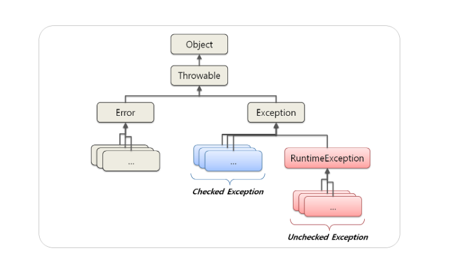
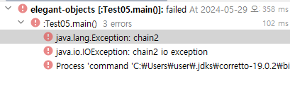
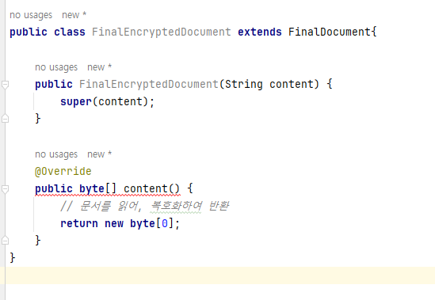

# Chapter 4.Retirement

- 이번 장에는 메서드 결과로 **반환되는 NULL, 예외 처리, 리소스 획득에 관해 살펴본다.**

### 1. 절대 NULL을 반환하지 마세요
````java
public String title() {
    if (/* title이 없다면 */) {
        return null;
    }
    return "Elegant Objects";
}

String title = x.title(); 
print(title.length());
````
- **title() 메서드가 반환하는 객체는 신뢰할 수 없다.**
- 이 객체는 장애를 안고 있기 때문에 특별하게 대우할 필요가 있습니다.
- title.length()를 호출할 때마다 항상 **NullPointerException 예외가 던져질지 모른다는 사실에 불안**할 수 밖에 없다.
- **객체에 대한 신뢰(trust)가 무너졌다.**

--- 
````java
String title = x.title(); 
if (title == null) {
    print("Can’t print; it’s not a title.");
    return;
} 
print(title.length());
````
- `객체`라는 사상에는 **우리가 신뢰하는 엔티티라는 개념이 담겨져 있다.**
- `객체`는 우리의 의도에 관해 전혀 알지 못하는 **데이터 조각이 아니다.**
- `객체`는 **자신만의 생명주기, 자신만의 행동, 자신만의 상태를 가지는 살아있는 유기체**이다.
- 우리는 `객체를 신뢰`하기 때문에 객체와 완벽하게 동일한 의미를 가지는 **변수(t) 역시 신뢰**한다.
  - String t = x.title();
  - 신뢰라는 말에는 **객체가 자신의 행동을 전적으로 책임지고(responsible) 우리가 어떤 식으로든 간섭하지 않는다** 는 의미이다.
- `객체`는 **자신이 맡은 일을 수행하는 방법을 스스로 결정**한다.
- 객체가 이름을 출력하는 대신 예외를 던지고 싶다면, 그것도 괜찮다.
  - 하지만 다음 코드에서 볼 수 있는 것처럼 객체 에게 아무런 말도 하지 않은 채 **우리 마음대로 예외를 던져서는 안된다.**
  - 이런 방식은 완전히 잘못됐고 **무례하다.**
  ````java
  if (title == null) {
    print("Can’t print; it’s not a title."); 
    return;
  }
  ````
- **반환값을 검사하는 방식**은 **애플리케이션에 대한 신뢰가 부족하다는 명백한 신호**이다.
- **NULL을 사용하면 전체 소프트웨어에 대한 신뢰가 크게 손상**되고, 소프트웨어가 **유지보수 불가능할 정 도로 엉망**이 되고 말 것이다. 
  - **결과가 NULL이 아닌지를 중복으로 체크**해야한다. 
- **코드를 읽을 때** 신뢰할 수 있는 메서드 호출이 어떤 것이고 NULL을 반환하는 메서드 호출이 어떤 것인지 파악하는데 **많은 시간이 걸린다.**
- 우리에게는 **신뢰가 필요하지만 NULL은 우리에게서 신뢰를 앗아간다.**
  - 작업 속도 저하
  - 모든 반환값 체크
  - 코드 유지보수성 저하
- **NULL을 반환하는 방식은 잘못됐으며 무례하다.**
- 왜 그렇게 NULL을 반환하는 코드가 흔하고 널리 사용되는 것일까?
  - 필자는 JDK를 설계하던 시점에 **빠르게 실패하기 원칙(fail fast principle)을 몰랐기 때문**이라고 추측한다.
  - 필자는 **NULL을 반환해서 사용자가 필요에 따라 예외를 던질 수 있도록 하는 방식이 더 좋은 설계라고 생각**했다고 추측한다.

#### 1. 빠르게 실패하기 vs 안전하게 실패하기
- `소프트웨어 견고성(software robustness)`과 `실패 탄력회복성(failure resilience)` 관련해서 **상반 되는 두 가지 철학이 존재**한다.
- `빠르게 실패하기(fail fast)`
  - 필자는 **강하게 찬성하는 입장.**
  - **문제가 발생하면 곧바로 실행을 중단 하고 최대한 빨리 예외를 던진다.**
  - 만약 소프트웨어가 부서지기 쉽고 **모든 단일 제어 지점(single control point)에서 중단되록 설계됐다면**, `단위 테스트` 에서 **실패 상황을 손쉽게 재현할 수 있을 것이다.**
  - 프로덕션 환경에서 실패한다고 해도, **모든 실패 지점이 명확하고 훌륭하게 문서화되어 있기 때문에 상황을 재생하는 테스트를 쉽게 추가할 수 있다.**
  - **실패를 감추는 대신 강조한다.** **실패를 눈에 잘 띄게 만들고 추적하기 쉽게 만든다.**
    ````java
    void list(File dir) {
      File[] files = dir.listFiles();
      if (files == null) {
         throw new IOException("Directory is absent.");
      }
      for (File file : files) {
       System.out.println(file.getName());
      }
    }
    ````
- `안전하게 실패하기(fail safe)`
  - 필자는 **강하게 반대하는 입장.**
  - **안전하게 실패하기**는 버그, 입출력 문제, 메모리 오버플로우 등이 발생한 상황에서도 **소프트웨어가 계속 실행될 수 있도록 최대한 많은 노력을 기울일 것을 권장**한다.
  - 어떤 상황이 닥치더라도 **소프트웨어는 생존하기 위해 노력**한다.
  - IOException을 던지는 대신, **누군가 이 상황을 처리할 수 있도록 NULL을 반환**한다.
    ````java
    void list(File dir) {
       for (File file : dir.listFiles()) {
          System.out.println(file.getName());
       }
    }
    ````
> **빠르게 실패하기**  
> - 에러를 발견한 즉시 보고하는 경우에만 안전성과 견고함을 얻을 수 있다.
> - 더 빠르게 실패하고, 결과적으로 전체적인 품질이 향상된다. 반대로 더 오래 숨 길수록 문제는 더 커진다.
> - 버그는 분명히 존재한다. 이 사실을 감춤으로써, 스스로에게 죄를 짓고 있는 것이다. 
> - 상처를 드러내어 치료하는 대신, **상처를 숨기고 모든 일이 순조롭게 진행될 것이라고 환자에게 거짓말**을 하고 있는 것이다.
> - **문제를 더 빨리 발견할수록 문제를 수정하는 시간 역시 빨라진다.**
> - 많은 Java 메서드가 예외를 던지지 않고 NULL을 반환하는 것일까?
>   - 대부분 의 개발자들이 안전하게 실패하기 철학을 믿기 때문이 아닌가 싶다.
>   - **하나의 메서드가 아닌 전체 애플리케이션의 품질을 고려 한다면 빠르게 실패하기 원칙을 따르는 편이 좋다.**


#### 2. NULL의 대안
- **실제 객체 대신 NULL을 반환하는 가장 흔한 경우이다.**
  - `안전하게 실패하기` 철학과 매우 유사한 형태이다.
    ````java
    public User user(String name) {
      if (/* 데이터베이스에서 발견하지 못했다면 */) { 
          return null;
      }
      return /* 데이터베이스로부터 */;
    }
    ```` 
- NULL을 반환하는 방식의 대안으로는 어떤 것이 있을까?
  - **첫 번째 방법은 메서드를 두 개로 나누는 것이다.**
    - exists() 메서드는 객체의 존재를 확인
    - user(name) 메서드는 예외를 던진다.
    - 요청을 두 번 전송하기 때문에 비효율적이라는 단점이 있다.
    ````java
    public boolean exists(String name) {
      if (/* 데이터베이스에서 발견하지 못했다면 */) { 
        return false;
      }
      return true;
    }
    public User user(String name) {
      return /* 데이터베이스로부터 */;
    }
    ````
  - **두 번째 방법은 NULL을 반환하거나 예외를 던지는 대신 객체 컬렉션을 반환하는 것이다.**
    - 기술적으로 이 방법은 **NULL과 크게 다르지는 않지만 더 깔끔하다.** 
    ````java
    public Collection<User> users(String name) {
      if (/* 데이터베이스에서 발견하지 못했다면 */) { 
         return new ArrayList(0);
      }
      return Collections.singleton(/* 데이터베이스로부터 */);
    }
    ````
  - **세 번째 방법은 널 객체(null object) 디자인 패턴이다.**
    - 겉으로 보기에는 원래의 객체처럼 보이지만 **실제로는 다르게 행동하는 객체를 반환한다.**
    - **널 객체는 일부 작업은 정상적으로 처리하지만, 나머지 작업은 처리하지 않는다.**
    - 객체지향적인 사고방식과도 잘 어울리지만, **제한된 상황에서만 사용 가능하다는 단점**이 있다.
    - 반환된 객체의 타입을 동일하게 유지해야 한다는 사실에도 주의해야 한다.
    ````java
    class NullUser implements User { 
      private final String label;
      NullUser(String name) { 
        this.label = name;
      }
      @Override
      public String name() { 
        return this.label;
      }
      @Override
      public void raise(Cash salary) {
         throw new IllegalStateException("제 봉급을 인상할 수 없습니다. 저는 스텁(stub)입니다.");
      }
    }
    ````

- **Optional**  
  - (필자)의미론적으로 부정확하기 때문에 OOP와 대립한다고 생각하며 사용을 권하지 않는다.
  - 실제로 반환하는 객체는 사용자가 아니라 사용자를 포함하는 일종의 봉투이다.
  - 이방법은 오해의 여지가 있으며 객체지향적인 사고방식과도 거리가 멀다.
  - NULL 참조와 매 우 비슷하다.

> **요약**
> - **절대로 NULL을 반환하지 마세요.**
> - OOP에서 NULL을 사용하는 상황에 대해서는 **어떤 변명도 있을 수 없다.**
> - 찾지 못한 뭔가를 반환할 필요가 있다면 NULL 대신 **예외를 던지거나**, **컬렉션을 반환**하거나, **널 객체를 반환**해야 한다.


### 2. 체크 예외(checked exception)만 던지세요
- **체크 예외**(checked exception)와 언체크 예외(unchecked exception)에 관해 이야기 한다.
  - java는 두 종류의 예외를 모두 제공한다.
- 언체크 예외를 사용하는 것은 실수이며, 모든 **예외는 체크 예외**여야 한다.
  - 다양한 예외 타입을 만드는 것도 좋지 않은 생각이다.
- 대부분의 언어들에서 언체크 예외만 사용할 수 있다.

#### [체크 예외]
- 무슨 일이 있어도 **content()를 호출하는 쪽에서 IOException 예외를 잡아야 한다는 것을 의미한다.**
- **예외를 저 위로 띄워 올린다.** 
- 관리를 할 때 흔히 그러는 것처럼, **문제를 더 높은 레벨로 확대시킨다.**
- IOException은 catch 구문을 이용해서 반드시 잡아야 하기 때문에 **체크(checked) 예외에 속한다.**
- **체크 예외가 항상 가시적인(visible)이다.**
  - length() 메서드를 이용하는 동안에는 content()라는 해롭고 안전하지 않은 메서드를 다루고 있다는 사실을 상기 시킨다.
````java
public byte[] content(File file) throws IOException {
  byte[] array = new byte[1000];
  new FilelnputStream(file).read(array);
  return array;
}

//호출부
public int length(File file){
  try{
    return content(file).length();
  } catch(IOExpceion e){
    //여기서 예외처리 또는 상위레벨로 전달
  }
}

public int length(File file) throws IOException{
    return content(file).length();
}
````

#### [언체크 예외]
- **언체크 예외는 무시할 수 있으며, 예외를 잡지 않아도 무방하다.**
- 일단 **언체크 예외를 던지면, 누군가 예외를 잡기 전까지는 자동으로 상위로 전파**된다.
- **호출부가 어떤 예외가 던져질지 예상할 수가 없다.**
  - **IllegalArgumentException에 대한 정보는 숨겨져 있다.**
  ````java
  public int length(File file) throws IOException{
    if(!file.exists()){
        throw new IllegalArgumentException("오류야");
    }
    return content(file).length();
  }
  ````
- **언체크 예외의 경우 예외의 타입을 선언하지 않아도 무방한 반면에 체크 예외는 항상 예외의 타입을 공개해야 한다.**
  - RuntimeException 클래스를 상속받는 예외 클래스들은 복구 가능성이 없는 예외들이므로 컴파일러가 **예외처리를 강제하지 않는다.**
    - ex) NullPointerException, IllegalArgumentException
  - 언체크 예외는 Error와 마찬가지로 **에러를 처리하지 않아도 컴파일 에러가 발생하지 않는다**  



#### 1. **꼭 필요한 경우가 아니라면 예외를 잡지마세요**
- **상위로 예외를 전파하는 방법이 훨씬 좋다.** **가능하면 예외를 더 높은 레벨로 전파하자.**
- **catch 문에는 납둑할 수 있는 이유**가 있어야한다.
- 이상적인 어플리케이션은 **각 진입점 별로 오직 하나의 catch 문만 존재**해야 한다.
- **예외를 잡는것은 안전하게 실패하기 방법(비추천) 과 동일하다.**
  - 파일 시스템에 어떤 일이 발생하더라도 메서드는 종료되지 않는다.
    - 흐름 제어를 위한 예외 사용(using exceptions for flow control)
  ````java
  public int length(File file) { 
      try {
          return content(file).length();
      } catch (IOException ex) { 
          return 0;
      } 
  }
  ````

#### 2. **항상 예외를 체이닝하세요**
- **예외 되던지기(rethrowing)에 관해 살펴보자**
- **예외 체이닝(exception chaining)은 훌륭한 프랙티스 이다.**
- **원래의 문제를 새로운 문제로 감싸서 함께 상위로 던진다.**
- **여기에서 핵심은 문제를 발생시켰던 낮은 수준의 근본 원인(root cause)을 소프트웨어의 더 높은 수준으로 이동시켰다는 것이다.**
  ````java
  # GOOD : 문제를 발생시킨 근본 Exception ex 를 상위레벨로 던진다.
  public int length(File file) throws Exception{
    try {
        return content(file).length();
    } catch (IOException ex){                             
        //원래의 문제를 새로운 문제로 감싸서 함께 상위로 던진다.
        throw new Exception("길이를 계산할 수 없다.",ex);
    }
  }
  
  # BAD : 문제를 발생시킨 근본 원인에 대한 가치있는 정보가 손실된다.
  public int length(File file) throws Exception{
    try {
        return content(file).length();
    } catch (IOException ex){                   
        //상위로 근본 에러 원인을 던지지 않는다.          
        throw new Exception("길이를 계산할 수 없다.");
    }
  }
  ````
- **항상 예외를 체이닝하고 절대로 원래 예외를 무시하면 안된다.**
- **모든 예외를 잡아 체이닝한 후, 다시 던지는것이 예외를 처리할 수 있는 최선의 방법이다.**
- 예외 체이닝은 왜 필요한 것일까?
  - **예외 체이닝은 의미론적으로 문제와 관련된 문맥을 풍부하게 만들기 위해 필요하다.**
- 이상적으로 각각의 메서드는 발생할 수 있는 모든 예외를 잡은 후, 예외를 체이닝해서 다시 던져야 한다.
  - **한번 더 강조하지만 모든 예외를 잡아 체이닝한 후, 즉시 다시 던져야 한다.**
````java
public class Member {
    private String name;

    public Member(String name) throws Exception {

        if(1==1){
            chain1();
        }
        this.name = name;
    }

    private void chain1() throws Exception {

        try {
            chain2();
        }catch (Exception e){
            throw new Exception("chain1", e);
        }
    }

    private void chain2() throws Exception {
        try {
            throw new IOException("chain2 io exception");
        }catch (IOException e){
            throw new Exception("chain2",e);
        }
    }
}
````


#### 3. **단 한번만 복구하세요**
- **필요시, 가장 최상위 수준에서 오직 한번만 복구해라**
- 만약 **빠르게 실패하기 진영에 속한다면 예외 후 복구를 적용할 수 없다.**
  - 예외 후 복구는 `흐름 제어를 위한 예외 사용(using exceptions for flow control)`으로 알려진 **안티패턴의 또 다른 이름일뿐이다.**
````java
int age;
try {
    age = Integer, parselnt(text);
} catch (NumberFormatException ex) {
    // 여기에서 발생한 예외를 복구한다 
    age = -1;
}
````
- 하지만 무조건 예외를 잡아서는 안된다는 주장은 전적으로 옳지 않다. **딱 한번은 복구해야 한다.**
  - **복구지점은 사용자가 애플리케이션과 커뮤니케이션하는 진입점(entry point)을 의미한다.**
  - **이곳이 복구하기에 적합한 유일한 장소이다.**
````java
public class App {
    public static void main(String... args) { 
      try {
          System.out.println(new App().run());
      } catch (Exception ex) {
      System.err.println("죄송하지만 문제가 발생했습니다:" + ex.getLocalizedMessage());
      }
    }
}
````
> **요약**  
> - **항상 예외를 잡고, 체이닝하고, 다시 던지세 요. 가장 최상위 수준에서 오직 한번만 복구하세요. 이게 전부이다.**


#### 4. 관점-지향 프로그래밍을 사용하세요
- 예외를 꼭 복구해야하는경우, **AOP를 통한 실패재시도는 OOP의 코드를 깔끔한 상태를 유지**할 수 있다는 현실적이며, 실용적인 예이다.
- **AOP는 단순하면서도 강력한 프로그래밍 패러다임으로 OOP와도 궁합이 잘 맞는다.**
  ````java
  public String conetnet() throws IOException{
      int attempt = 0;
      while(true){
          try{
            return http();
          }catch (IOException ex){
              if(attempt >=2) throw ex;
          } 
      }
  }
  //Java 6에서 AOP를 사용한다면 재시도 메커니즘을 다음과 같이 구현할 수 있다.
  @RetryOnFailure(attempts =3)
  public String content() throws IOException{
    return http();  
  }
  ````

#### 5 하나의 예외 타입만으로도 충분합니다.
- 사실 단 한번만 복구한다면 어떤 예외라도 담을 수 있는 예외 객체만 있으면 된다.
  - 절대 복구하지 않기 / 항상 체이닝하기
- **잡은 예외의 실제 타입에 대해서는 신경 쓸 필요가 없습니다.** **어차피 다시 던질 것이기 때문이다.**
- **최상위에서, 어떤 예외라도 담을 수 있는 예외 객체만 있으면 해당 객체로 최상위 레벨에서 복구하거나 또는 오류를 처리할 수 있다.**

### 3. final이나 abstact이거나
- **상속(inheritance)을 올바르게 사용하는 방법에대해 설명**한다.
- 사실 우리가 원하는 것은 상 속을 완전히 제거하는 것이 아니라 **올바르게 사용하는 것**이다.
- **상속이 해로운 이유**와 **상속으로 인해 발생하는 문제**를 방지하기 위해 무엇을 할 수 있는지 확인해보자.
  - 상속에 반대하는 가장 강력한 주장은 **상속이 객체들의 관계를 너무 복잡하게 만든다**는 것이다.
  - 근본적인 원인은 상속 그 자체가 아니고, **문제를 일으키는 주범은 가상 메서드(virtual method)이다.**
#### [상속]
- Document content 의 length 길이를 원하는 거였지만, EncryptedDocument의 length를 반환해 **오류를 야기할 수 있다.**
- **content length 가 객체별로 어떤행동을 하는지 명확하게 알 수가 없는 코드이다.**
- 자식이 부모의 유산에 접근하는 일반적인 상속과 달리, **메서드 오버라이딩은 부모가 자식의 코드에 접근하는 것을 가능하게 한다.**
  - 상속이 OOP를 지탱하는 편리한 도구에서 **유지보수성을 해치는 골치덩어리로 추락하는 곳이 바로 이 지점이다.**
  - **복잡성이 상승하고, 코드를 읽고 이해하기가 매우 어려워진다.**
````java
class Document {
  public int length(){
      return this.content().length();
  }
  public byte[] content() {
      //문서를 읽어 바이트 배열로 로드한다.
  }
}

class EncryptedDocument extends Document {
  @Override
  public byte[] content(){
      //문서를 읽어, 복호화 하여 반환
  }
}

Document document = new Document("1");
EncryptedDocument encryptedDocument = new EncryptedDocument("2");
Document parentDocument = new EncryptedDocument("3");
````
- 클래스와 메서드를 `final`이나 `abstract` **둘 중 하나로만 제한한다면 문제가 발생할 수 있는 가능성을 없앨 수 있다.**
- 클래스 앞 final **수정자** 는 이 클래스 안의 **어떤 메서드**도 **자식 클래스에서 오버라이딩 할 수 없다는 사실을 컴파일러에 알려준다.**
#### [final]
````java
public class FinalDocument {
    private String content;
    public FinalDocument(String content) {
        this.content = content;
    }
    // final 메서드는 오버라이딩될 수 없다.
    public final int length() {
        return this.content.length();
    }
    // final 메서드는 오버라이딩될 수 없다.
    public final byte[] content() {
        return content.getBytes();
    }
}
````

#### [final 2]
- final1을 해결하기 위해 interface 를 추가해야한다.
- DefaultDocument와 EncryptedDocument **모두 final이기 때문에 확장이 불가능하다.**
````java
interface Document {
  int length();
  byte[] content();
}

final class DefaultDocument implements Document {
  @Override
  public int length() {...}
  @Override
  public byte[] content() {...}
}
  
final class EncryptedDocument implements Document {
  private final Document plain;
  EncryptedDocument(Document doc){
      this.plain = doc;
  }

  @Override
  public int length(){
      return this.plain.length();
  }
  
  @Override
  public byte[] content() {
    byte[] raw = this.plain.content();
    return /* 원래 내용을 복호화*/
  } 
}
````
#### [abstract]
- 스스로 행동할 수 없기 때문에 누군가의 도움이 필요하며 일부 요소가 누락되어 있다. 
- 기술적인 관점에서 abstract 클래스 는 아직 클래스가 아니다. 
````java
public abstract class AbstractDocument {
    private String content;

    public AbstractDocument(String content) {
        this.content = content;
    }

    // abstract 메서드는 하위 클래스에서 반드시 구현해야 합니다.
    public abstract byte[] content();
    
    //공통 메서드
    public int length() {
        return this.content.length();
    }
}

public class AbstractEncryptedDocument extends AbstractDocument{
  public AbstractEncryptedDocument(String content) {
    super(content);
  }
    
  //무조건 구현!
  @Override
  public byte[] content() {
    return new byte[0];
  }
}

````
- **상속이 적절한 경우는 언제일까?**
  - **클래스의 행동을 확장(extend)하지 않고 정제 (refine)할 때이다.**
  - `확장`이란 새로운 행동을 추가해서 `기존의 행동을 부분적으로 보완`하는 일을 의미한다.
  - `정제`란 부분적으로 `불완전한 행동을 완전하게 만드는 일`을 의미한다.
- OOP에서는 어떤 것도 **확장 할 수 없어야** 한다, 클래스 확장은 곧 **침범**(intrusion)을 의미한다.
- abstract 추상클래스 올바른 설계
    - 추상클래스를 사용함으로써, 두 클래스 모두 length() 메서드가 자신들의 메서드 사용 방법을 명확하게 알고 있다.
  ````java
  abstract class Document {
    public abstract byte[] content();
    public final int length() {
        return this.content().length;
    }
  }
  
  final class DefaultDocument extends Document {
    @Override
    public byte[] content(){
        //내용을 로드한다.
    }
  }
  
  final class EncryptedDocument extends Document {
    @Override
    public byte[] content(){
        //내용을 로드한다.
    }
  }
  ````

### 4. RAII를 사용하세요

- RAII (Resource Acquisition Is Initialization)
    - **리소스 획득이 초기화**라는 개념, 객체가 살아있는 동안에만 리소스를 확보하는 것
- 가비지 컬렉션을 이용해 객체를 제거하는 java에서는 사라진 개념이다.
- Java7에서도 RAII와 유사한 처리를 할 수 있는 기능이 있다.
  ````java
  - Text 클래스가 Closable 인터페이스를 구현하도록 되어 있다.
  try(Text t = new Text("/tmp/test.txt")){
    t.content();
  }
  ````
- 파일, 스트림, 데이터베이스 컨넥션 등 실제 리소스를 사용하는 모든곳에서 RAII를 사용할 것을 적극 추천한다.
    - AutoClosable 사용
